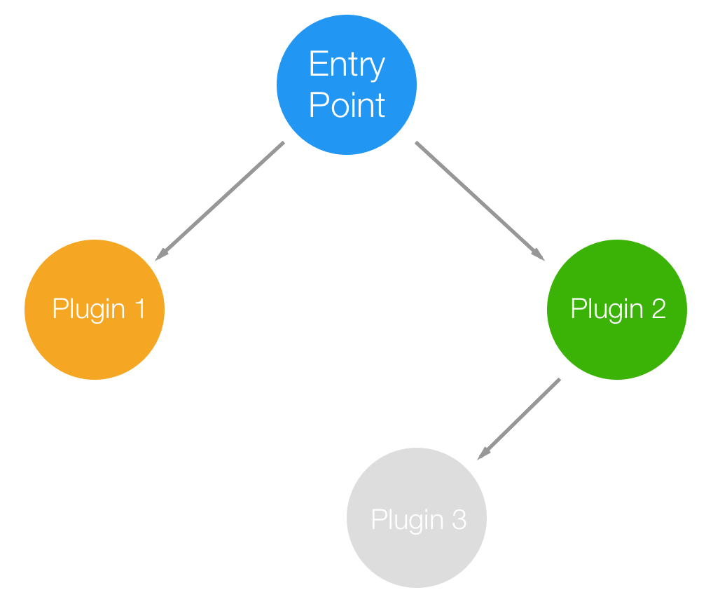
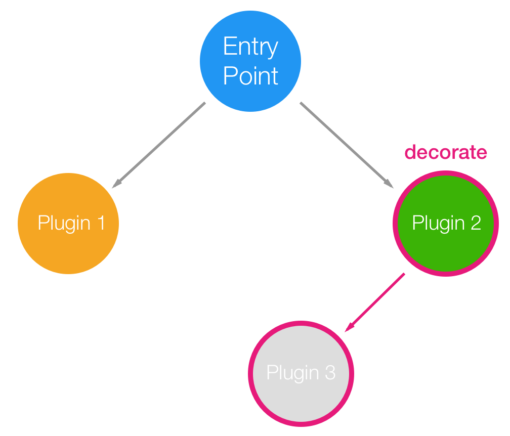
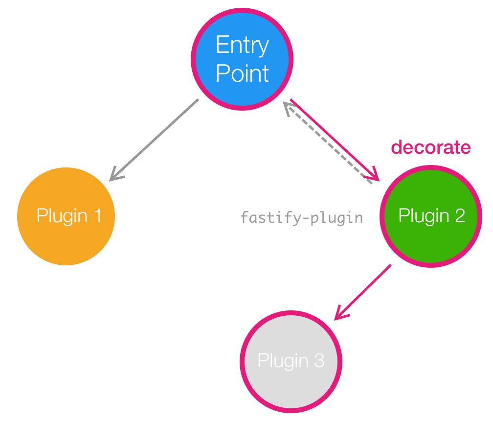
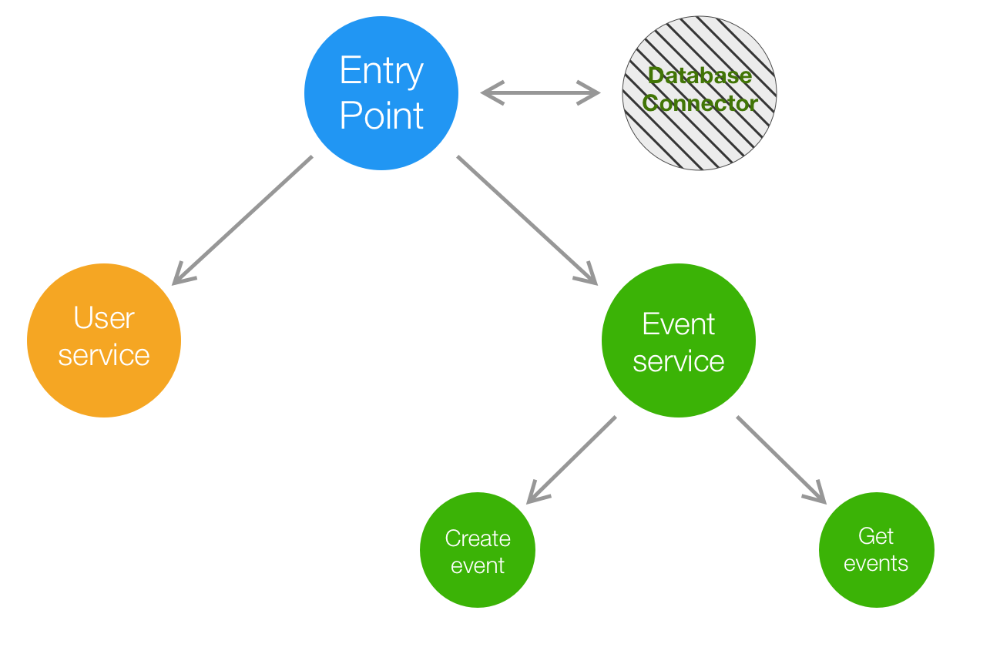
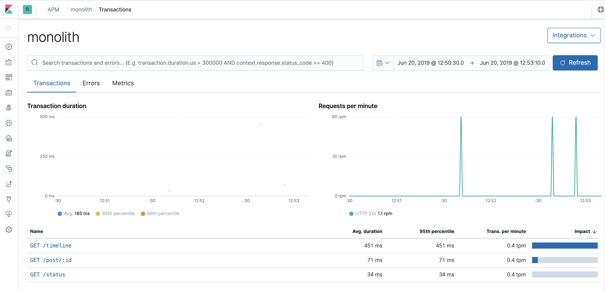

export { theme } from './config'
import { CodeSurferLayout, Code } from 'code-surfer'
import { Appear, Image } from 'mdx-deck'
import { Big, Center } from './config'

<Big>

# Take your monolith<br/>to *microservices* with Fastify

</Big>

---

# About Us

***Tomas Della Vedova***  
Senior Software Engineer - Elastic

***Matteo Collina***  
Technical Director - NearForm

---

# Setup

https://bit.ly/2KGS2vo

---

<Image src="images/fastify-background.png">

<Center>


</Center>

</Image>

---

<CodeSurferLayout>

```js
'use strict'

const fastify = require('fastify')()

fastify.get('/', async (req, reply) => {
  return { hello: 'world' }
})

fastify.listen(3000, console.log)
```

</CodeSurferLayout>

---

# Validation

---

<CodeSurferLayout>

```js title="JSON Schema"
const schema = {
  body: {
    type: 'object',
    properties: {
      user: { type: 'string' },
      age: { type: 'integer' }
    },
    required: ['user', 'age']
  }
}

fastify.post('/', { schema },  async (req, reply) => {
  return { hello: 'world' }
})
```

```js title="Fluent Schema"
const S = requrie('fluent-schema')
const schema = S.object()
  .prop('user', S.string()).required()
  .prop('age', S.integer()).required()

fastify.post('/', { schema },  async (req, reply) => {
  return { hello: 'world' }
})
```

</CodeSurferLayout>

---

<Big>

# Fastify *Plugins*
A brief overview

</Big>

---

<CodeSurferLayout>

```js
fastify.register(
  require('my-plugin'),
  { options }
)
```

</CodeSurferLayout>

---

<CodeSurferLayout>

```js
async function myPlugin (fastify, opts) {
  // register other plugins
  fastify.register(...)

  // add hooks
  fastify.addHook(...)

  // add decorator
  fastify.decorate(...)

  // add routes
  fastify.route(...)
}

module.exports = myPlugin
```

</CodeSurferLayout>

---

## Plugins: *Architecture*


---

## Plugins: *Encapsulation*


---

<CodeSurferLayout>

```js
async function myPlugin (fastify, options) {
  fastify.decorate('util', yourAwesomeUtility)
  // now you can use it with `fastify.util`
}
```

```js
async function myPlugin (fastify, options) {
  fastify.decorate('util', yourAwesomeUtility)
  // now you can use it with `fastify.util`
}

module.exports = myPlugin
```

```js
const fp = require('fastify-plugin')

async function myPlugin (fastify, options) {
  fastify.decorate('util', yourAwesomeUtility)
  // now you can use it with `fastify.util`
}

module.exports = fp(myPlugin)
```

</CodeSurferLayout>

---

## Plugins: *Encapsulation*


---

## Plugins: Real world


---

<CodeSurferLayout>

```js title="Encapsulation enables cool things"
const fastify = require('fastify')()

fastify.register(require('./api/v1'), {
  prefix: '/v1'
})
```

```js title="Multiple version of the API"
const fastify = require('fastify')()

fastify.register(require('./api/v1'), {
  prefix: '/v1'
})

fastify.register(require('./api/v2'), {
  prefix: '/v2'
})
```

```js title="Different log levels"
const fastify = require('fastify')()

fastify.register(require('./api/v1'), {
  prefix: '/v1',
  logLevel: 'error'
})

fastify.register(require('./api/v2'), {
  prefix: '/v2',
  logLevel: 'debug'
})
```

</CodeSurferLayout>

---

<Big>
<Center>

# *Everything*<br/>is a plugin

</Center>
</Big>

---

<Big>
<Center>

# Let's start*!*

</Center>
</Big>

---

# A little bit of configuration
Being *consistent* across microservices is a difficult task,  
to *help you* Fastify provides a powerful CLI.

```bash
npx fastify generate workshop
cd workshop
npm install
```

---

# Project structure
- *app.js*: your entry point;
- *services*: the folder where you will declare all your endpoints;
- *plugins*: the folder where you will store all your custom plugins;
- *test*: the folder where you will declare all your test.

---

# Scripts
- *`npm start`*: run your server;
- *`npm run dev`*: run your server with pretty logs  
(not suitable for production);
- *`npm test`*: run your test suite.

---

# Exercise*:*

Generate the project and run it!

---

# Exercise*:*

Create a simple status service that exposes a status route.
```
GET /status => { status: 'ok' }
```

---

<CodeSurferLayout>

<Code
  title="Testing"
  lang="js"
  focus="1:23"
  code={require("!!raw-loader!./code/test.js").default}
/>

<Code
  title="Testing"
  lang="js"
  focus="1:23"
  code={require("!!raw-loader!./code/test.js").default}
/>

<Code
  lang="js"
  focus="3"
  code={require("!!raw-loader!./code/test.js").default}
  subtitle="Require the test framework"
/>

<Code
  lang="js"
  focus="5:7"
  code={require("!!raw-loader!./code/test.js").default}
  subtitle="Require the helper to build the application"
/>

<Code
  lang="js"
  focus="9"
  code={require("!!raw-loader!./code/test.js").default}
  subtitle="Create a new test block"
/>

<Code
  lang="js"
  focus="10"
  code={require("!!raw-loader!./code/test.js").default}
  subtitle="Create the application"
/>

<Code
  lang="js"
  focus="11:14"
  code={require("!!raw-loader!./code/test.js").default}
  subtitle="Inject an http request"
/>

<Code
  lang="js"
  focus="16:17"
  code={require("!!raw-loader!./code/test.js").default}
  subtitle="Check the response!"
/>

</CodeSurferLayout>

---

# Exercise*:*

Test your application.

---

# Authentication

Protecting your application is important.


---

# Exercise*:*

Create an authentication plugin that uses [fastify-basic-auth](https://github.com/fastify/fastify-basic-auth).

Create also two fake users to test your application.
```js
const users = {
  arya: 'stark', // Basic YXJ5YTpzdGFyaw==
  jon: 'snow' // Basic am9uOnNub3c=
}
```

---

<CodeSurferLayout>

<Code
  lang="js"
  focus="1:29"
  code={require("!!raw-loader!./code/basic-auth.js").default}
/>

<Code
  lang="js"
  focus="3:4"
  code={require("!!raw-loader!./code/basic-auth.js").default}
  subtitle="Require the dependencies"
/>

<Code
  lang="js"
  focus="6:9"
  code={require("!!raw-loader!./code/basic-auth.js").default}
  subtitle="Our 'database'"
/>

<Code
  lang="js"
  focus="12:13"
  code={require("!!raw-loader!./code/basic-auth.js").default}
  subtitle="Register the basicAuth plugin and decorate the request with a user object"
/>

<Code
  lang="js"
  focus="15:18"
  code={require("!!raw-loader!./code/basic-auth.js").default}
  subtitle="Validate the username and password"
/>

<Code
  lang="js"
  focus="20:26"
  code={require("!!raw-loader!./code/basic-auth.js").default}
  subtitle="If the user exist, let's add its topics"
/>

</CodeSurferLayout>

___

# Exercise*:*

Test your plugin.

---

<CodeSurferLayout>

```js
fastify.route({
  method: 'GET',
  path: '/post/:id',
  handler: onGetPost
})
```

```js
fastify.route({
  method: 'GET',
  path: '/post/:id',
  onRequest: fastify.basicAuth,
  handler: onGetPost
})
```

</CodeSurferLayout>

---

# Exercise*:*

Create a new `/me` route that returns `req.user`. Add a test.

---

# Let's add our *database*

- npm.im/fastify-elasticsearch
- npm.im/@delvedor/fastify-workshop-dataset

---

<CodeSurferLayout>

```js
module.exports = async function (fastify, opts) {
  fastify.register(AutoLoad, {
    dir: path.join(__dirname, 'plugins'),
    options: Object.assign({}, opts)
  })

  fastify.register(AutoLoad, {
    dir: path.join(__dirname, 'services'),
    options: Object.assign({}, opts)
  })
}
```

```js
module.exports = async function (fastify, opts) {
  fastify.register(
    require('fastify-elasticsearch'),
    { node: 'http://localhost:9200' }
  )

  fastify.register(require('@delvedor/fastify-workshop-dataset'))

  fastify.register(AutoLoad, {
    dir: path.join(__dirname, 'plugins'),
    options: Object.assign({}, opts)
  })

  fastify.register(AutoLoad, {
    dir: path.join(__dirname, 'services'),
    options: Object.assign({}, opts)
  })
}
```

</CodeSurferLayout>

---

<CodeSurferLayout>

```js title="Index a new document in Elasticsearch"
await fastify.elastic.index({
  index: 'westeros',
  id: 'stark-house'
  body: {
    house: 'Stark',
    motto: 'Winter is coming',
    region: 'north'
  }  
})
```

</CodeSurferLayout>

---

# Exercise*:*

Create an endpoint to index a new tweet,  
the endpoint should return the tweet id.  
**Bonus:** Add route validation.

You can use [Hyperid](http://npmjs.com/package/hyperid) for generating the IDs.
```
{
  id: String,
  text: String,
  user: String,
  time: DateString,
  topics: String[]
}
```

---

# Exercise*:*

Test your application.

---

<CodeSurferLayout>

```js title="Get a document by id in Elasticsearch"
const { body } = await fastify.elastic.get({
  index: 'westeros',
  id: 'stark-house'
})

console.log(body._source)
```

</CodeSurferLayout>

---

# Exercise*:*

Create an endpoint to get a tweet by id.  
**Bonus:** Add route validation.

```
GET /tweet/:id => {
                    id: String,
                    text: String,
                    user: String,
                    time: DateString,
                    topics: String[]
                  }
```

---

# Exercise*:*

Test your application.

---

<CodeSurferLayout>

```js title="Search documents ordered by time in Elasticsearch"
const { body } = await fastify.elastic.search({
  index: 'westeros',
  query: { match_all: {} },
  sort: { time: { order: 'desc' } }
})

const docs = body.hits.hits.map(h => h._source)
console.log(docs)
```

</CodeSurferLayout>

---

# Exercise*:*

Create an endpoint to get a tweet timeline, ordered by time.  
**Bonus:** Boost the results with a given topic.

```
GET /timeline => [{
                    id: String,
                    text: String,
                    user: String,
                    time: DateString,
                    topics: String[]
                 }]
```

---

<CodeSurferLayout>

<Code
  title="Boost the results with a given topic."
  lang="js"
  focus="1:35"
  code={require("!!raw-loader!./code/query.js").default}
/>

<Code
  subtitle="Create a term filter for every topic."
  lang="js"
  focus="1:8"
  code={require("!!raw-loader!./code/query.js").default}
/>

<Code
  subtitle="Create a function score query and search all documents"
  lang="js"
  focus="11:15"
  code={require("!!raw-loader!./code/query.js").default}
/>

<Code
  subtitle="Boost the results based on the functions"
  lang="js"
  focus="16:28"
  code={require("!!raw-loader!./code/query.js").default}
/>

</CodeSurferLayout>

---

# Exercise*:*

Test your application.

---

# Exercise*:*

Update your test.

---

# Let's talk about *observability*

```
npm i elastic-apm-node
```

---

<CodeSurferLayout>

```json
{
  "dev": "fastify start -l info -P app.js",
}
```

```json
{
  "dev": "fastify start -l info -P app.js",
  "apm": "NODE_OPTIONS=\"-r elastic-apm-node/start\" fastify start -l info -P app.js"
}
```

</CodeSurferLayout>

---

# Exercise*:*

Open Kibana and run your application with APM.

```
http://localhost:5601
```

---



---

# From monolith<br/>to *microservices*

Let's begin*!*

---

# Exercise*:*
<ul>
  <Appear>
    <li><em>Duplicate</em> the project three times</li>
    <li>Keep only <em>one service</em> per project</li>
    <li><em>Run</em> the services!</li>
  </Appear>
</ul>

---

# Awesome!
Now update *all your clients* so they know  
which address to call based on the service they need to use.


---

<Big>
<Center>

# *WRONG!*

</Center>
</Big>

---

# The infrastructure<br/>should be *transparent*<br/>to the client.

---

# Exercise*:*

How can we fix this?

---

<Image src="images/fastify-background.png">

<Center>


</Center>

</Image>

---

<Center>
<Big>

# Thanks*!*

</Big>
</Center>
